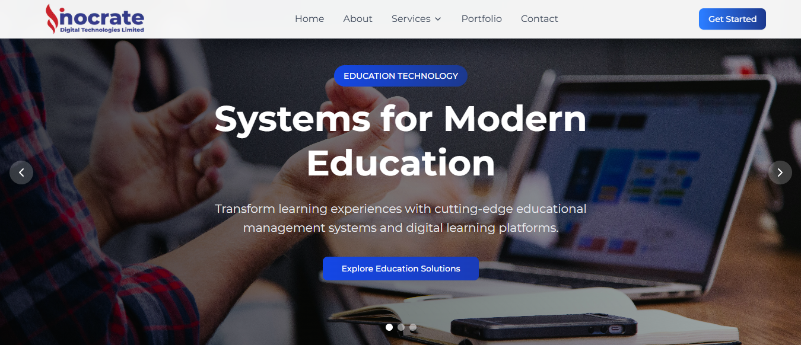

# Inocrate - Innovative Technology Solutions

## About Inocrate

Inocrate is a forward-thinking technology company dedicated to revolutionizing the **education**, **fintech**, and **agritech** sectors through innovative digital solutions. We believe in the power of technology to transform businesses and create meaningful impact in people's lives.

Our team of experienced developers, designers, and strategists work together to deliver solutions that are not only technically excellent but also user-friendly and business-focused. With over **50+ successful projects** and **25+ satisfied clients**, we have established ourselves as a trusted partner for digital transformation.

---

## Our Mission

To empower businesses with innovative technology solutions that drive growth, efficiency, and positive impact across industries.

## Our Vision

To be the leading technology partner for businesses seeking digital transformation and sustainable growth in the modern economy.

## Our Values

- **Innovation**: We constantly push boundaries to deliver cutting-edge solutions
- **Security**: Security is at the core of everything we build
- **Collaboration**: We work closely with our clients to understand their needs
- **Efficiency**: Our solutions are designed to optimize processes and maximize productivity

---

## Industry Expertise

### 🎓 Education Technology

We transform learning experiences with comprehensive educational management systems and digital learning platforms that enhance educational outcomes and streamline administrative processes.

**Key Solutions:**

- Learning Management Systems (LMS)
- Student Information Systems
- Virtual Classrooms
- Mobile Learning Applications
- Analytics & Reporting Tools

### 💳 Financial Technology

Our fintech solutions revolutionize financial services with secure, scalable, and user-friendly platforms that enhance customer experiences and streamline operations.

**Key Solutions:**

- Payment Processing Platforms
- Digital Banking Solutions
- Cryptocurrency Trading Platforms
- Financial Analytics Tools
- Mobile Payment Systems

### 🌱 Agricultural Technology

We empower farmers with intelligent agricultural systems that optimize productivity and sustainability through cutting-edge IoT and data analytics technology.

**Key Solutions:**

- Smart Farm Management Platforms
- IoT Sensor Networks
- Agricultural Marketplaces
- Precision Farming Tools
- Crop Monitoring Systems

---

## Website Features

### 🎨 Modern Design

- **Responsive Design**: Optimized for all devices and screen sizes
- **Gradient Color Schemes**: Eye-catching visual elements throughout
- **Interactive Animations**: Smooth transitions and hover effects
- **Professional Typography**: Clean and readable font choices

### 🖼️ Dynamic Content

- **Hero Carousels**: Engaging banner sliders on every page
- **Project Portfolio**: Showcase of successful implementations
- **Case Studies**: Detailed success stories with metrics
- **Client Testimonials**: Real feedback from satisfied customers

### 📱 User Experience

- **Intuitive Navigation**: Easy-to-use menu system with dropdown services
- **Contact Forms**: Multiple ways to get in touch
- **Service Pages**: Detailed information about each industry solution
- **Mobile Optimization**: Seamless experience across all devices

### 🔧 Technical Excellence

- **Fast Loading**: Optimized performance for quick page loads
- **SEO Friendly**: Search engine optimized content and structure
- **Accessibility**: Built with web accessibility standards in mind
- **Modern Framework**: Built with Next.js, TypeScript, and Tailwind CSS

---

## Our Impact

| Metric                  | Achievement |
| ----------------------- | ----------- |
| **Projects Completed**  | 50+         |
| **Happy Clients**       | 25+         |
| **Industry Sectors**    | 3           |
| **Client Satisfaction** | 99%         |
| **Years of Experience** | 5+          |

---

## Success Stories

### TechEdu Institute

- **10,000+** students served across **50+** institutions
- **40%** increase in student engagement
- **95%** satisfaction rate

### FinanceFlow Corp

- **$50M+** in transaction volume processed
- **99.9%** system uptime maintained
- **Zero** security breaches

### GreenHarvest Farms

- **200+** farms connected to our platform
- **30%** increase in crop yield
- **25%** reduction in water usage

---

## Get Started

Ready to transform your business with innovative technology solutions? We'd love to hear about your project and explore how we can help you achieve your goals.

**Contact Information:**

- 📧 Email: <info@inocrate.com>
- 📞 Phone: +1 (555) 123-4567
- 📍 Address: 123 Innovation Street, Tech City, TC 12345
- 🌐 Website: [www.inocrate.com](https://inocrate.com)

---

_Empowering businesses through innovative technology solutions across education, fintech, and agritech sectors._

**© 2025 Inocrate. All Rights Reserved.**
